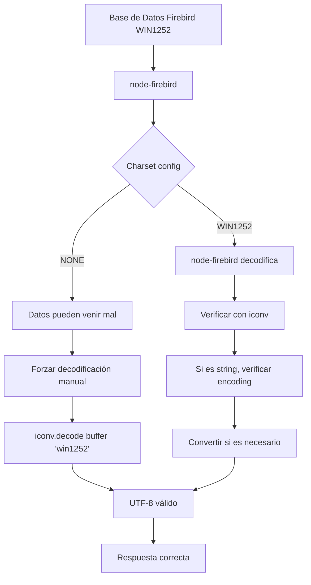

# Plan: Solución de Raíz para Encoding de Firebird

## Problema
La base de datos Firebird está en WIN1252, pero los datos no se decodifican correctamente a UTF-8, causando que caracteres como "ñ" aparezcan como "MUOZ" o se pierdan.

## Solución Propuesta

### 1. Cambiar Charset de Conexión
En `.env`, cambiar:
```
FIREBIRD_CHARSET=WIN1252
```

### 2. Modificar decodeFirebirdString en firebird.ts

La función debe:
- Si es Buffer: usar `iconv.decode(buffer, 'win1252')` -> UTF-8
- Si es string: verificar el encoding y convertir si es necesario

### 3. Eliminar Replace Temporales
- `fixSpanishCharacters` solo para mojibake residual
- No convertir "MUOZ" a "MUÑOZ" - esto debe resolverse con decodificación correcta

## Pasos de Implementación

### Paso 1: Actualizar .env
```bash
FIREBIRD_CHARSET=WIN1252
```

### Paso 2: Modificar firebird.ts
```typescript
function decodeFirebirdString(value: any): string | null {
  if (Buffer.isBuffer(value)) {
    // SIEMPRE decodificar desde WIN1252 a UTF-8
    return iconv.decode(value, 'win1252');
  }
  
  if (typeof value === 'string') {
    // Verificar si el string ya está en UTF-8 o necesita conversión
    // Si tiene caracteres de WIN1252 que no son válidos en UTF-8, convertir
    return convertFromWin1252IfNeeded(value);
  }
  
  return String(value);
}
```

### Paso 3: Verificar con Logs de Debug
Agregar logs para ver los valores hex de los caracteres problemáticos.

## Diagrama del Flujo de Datos



## Resultado Esperado
- "ñ" debe aparecer correctamente como "ñ" (U+00F1)
- No más "MUOZ" en lugar de "MUÑOZ"
- Todos los caracteres españoles (á, é, í, ó, ú, ñ, Ü, etc.) deben aparecer correctamente

## Archivos a Modificar
1. `.env` - Cambiar FIREBIRD_CHARSET
2. `src/db/firebird.ts` - Corregir decodeFirebirdString
